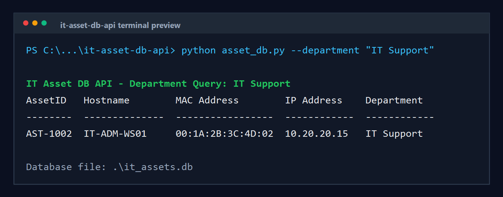

# IT Asset DB API

Built by Dean Wilshaw.

IT Asset DB API is a lightweight Python and SQLite backend for tracking hardware assets across an organisation. It provides a simple asset register with insert and department-based query functions, making it suitable for service desk, MSP, and internal IT inventory workflows.

## Terminal Preview



## The Business Problem

IT teams need reliable visibility of hardware assets: which devices exist, where they are assigned, and which department owns them. In many smaller environments, this data lives in spreadsheets, ticket notes, or technician memory. That makes audits slower, onboarding messier, and troubleshooting harder.

Common problems this project addresses:

- Hardware records scattered across spreadsheets or informal notes.
- No simple local database for service desk inventory checks.
- Difficulty querying assets by department during audits or refresh projects.
- Increased risk of duplicate IP or MAC records.
- Weak handover evidence when devices move between departments.

For MSPs and internal IT teams, a clean asset database is the foundation for endpoint management, lifecycle planning, and accountable infrastructure support.

## The Solution & Architecture

This project uses Python's built-in `sqlite3` module to provide a small local database backend. The script creates a `HardwareAssets` table, inserts assets with validated fields, and queries records by department.

### Database Table

The table is named `HardwareAssets` and contains:

| Column | Purpose |
| --- | --- |
| `AssetID` | Unique hardware asset identifier |
| `Hostname` | Device hostname |
| `MAC_Address` | Network adapter MAC address |
| `IP_Address` | Current or assigned IP address |
| `Department` | Owning business department |

### Core Functions

- `initialize_database(connection)` creates the SQLite table.
- `insert_asset(connection, asset)` inserts one validated hardware asset.
- `insert_assets(connection, assets)` inserts multiple hardware assets.
- `query_assets_by_department(connection, department)` returns assets for a department.
- `format_assets(assets)` formats query results for terminal output.

### Data Integrity

The database enforces:

- `AssetID` as the primary key.
- Unique `MAC_Address` values.
- Unique `IP_Address` values.
- Required values for all asset fields.

## Local Execution Setup

### Prerequisites

- Windows 10 or Windows 11
- Python 3.10 or newer recommended
- Command Prompt, PowerShell, or Windows Terminal

No third-party Python packages are required.

### Run the Demo Query

From the project folder:

```bash
python asset_db.py
```

By default, the script seeds deterministic demo assets and queries the `Finance` department.

### Query Another Department

```bash
python asset_db.py --department "IT Support"
```

```bash
python asset_db.py --department "Operations"
```

### Use a Custom Database File

```bash
python asset_db.py --db service_desk_assets.db --department "Finance"
```

## Example Output

```text
IT Asset DB API - Department Query: Finance
AssetID   Hostname        MAC Address        IP Address    Department
--------  --------------  -----------------  ------------  ------------
AST-1001  FIN-LAP-001     00:1A:2B:3C:4D:01  10.20.10.21   Finance
AST-1004  FIN-DESK-002    00:1A:2B:3C:4D:04  10.20.10.22   Finance

Database file: C:\path\to\it_assets.db
```

## Project Files

```text
asset_db.py      # Python SQLite asset database backend
it_assets.db     # Generated SQLite database after first run
README.md        # Project documentation
```

## Production Readiness Notes

- Add API routes with Flask, FastAPI, or another approved framework if remote access is required.
- Add authentication before exposing asset data beyond local execution.
- Add import/export support for CSV asset inventories.
- Add audit columns such as `CreatedAt`, `UpdatedAt`, and `LastSeen`.
- Extend validation for MAC and IP address formats before production use.
